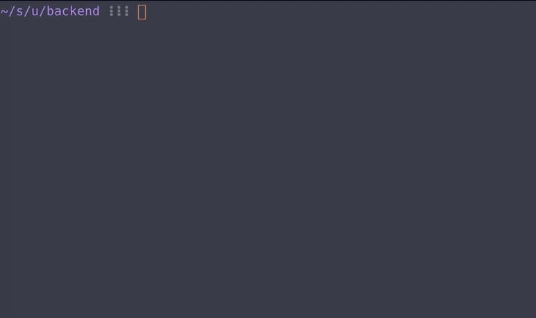

# ACC backend

*You need to enable udp port on broadcast.json on your windows documents folder*

Tested with nodejs `v10.7.0` and yarn version `1.9.2`.

This backend connects to ACC UDP port (default 9000) and following the API of 0.4. It exposes via websocket on port 6767 the following info:
- gear
- kmh
- delta

For the moment is only implemented partially `REALTIME_CAR_UPDATE` to get the following:
- carIndex
- driverIndex
- gear
- worldPosX
- worldPosY
- yaw
- carLocation
- kmh
- position
- cupPosition
- trackPosition
- splinePosition
- laps
- delta

This was tested on practice mode, so on a race it might not work ¯\_(ツ)_/¯

## Build and start
`yarn install`

`yarn run start`

### running local upd endpoint for debugging messages

`python udp_server.py`